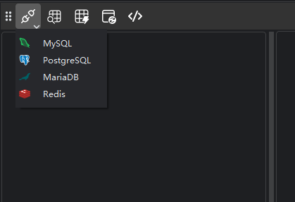
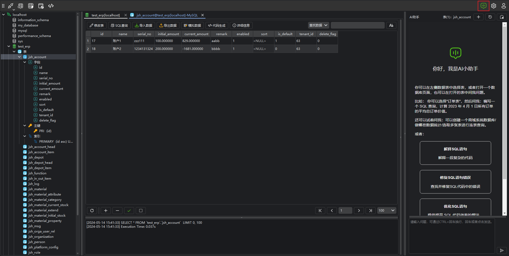
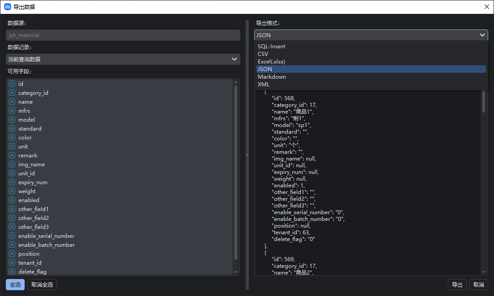
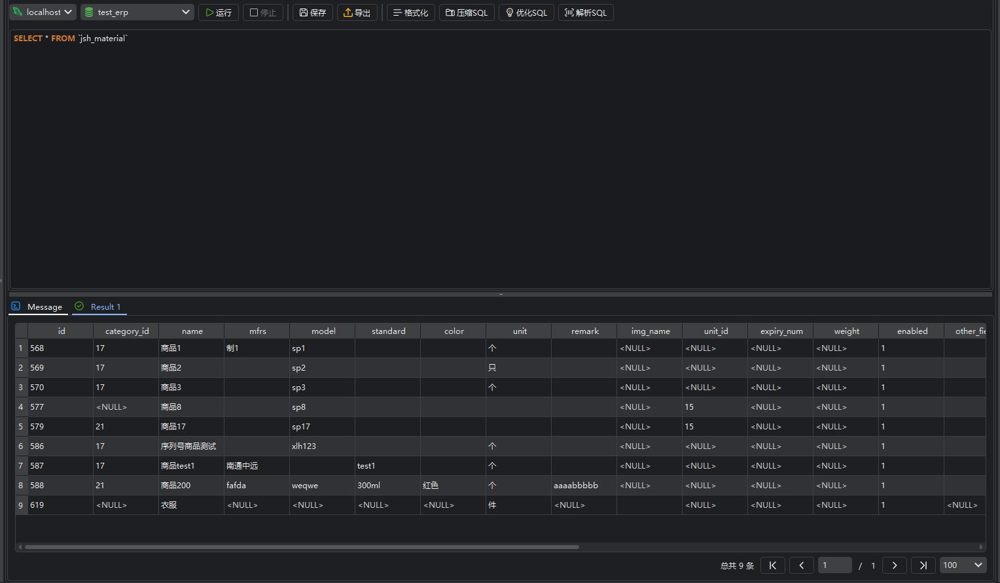

# DBLAB

  [<a href="README.md">English</a>]

欢迎使用DBLAB，多平台支持，与AI协作，探索全新的数据库管理体验。

DBLab是一款功能强大的数据库管理工具，旨在为用户提供直观、高效的数据库管理体验。通过AI和用户友好的界面，DBLab简化了数据库管理任务，使数据库管理员和开发人员能够更轻松地管理和操作各种数据库。

## 功能特定

- **智能AI助手**：DBLab集成了先进的ChatGPT AI助手，通过自然语言交互，用户可以轻松执行复杂的数据库任务，提高工作效率。
- **多数据库支持**：DBLab支持各种主流数据库，包括但不限于MySQL、PostgreSQL、MongoDB等。具体功能根据开放版本支持。
- **可视化查询界面**：通过直观的界面执行和优化SQL查询，支持结果集导出和可视化展示。
- **模式管理**：创建、修改和删除数据库表，支持丰富的数据类型和约束。
- **数据高数导出**：支持数据快速导入与导出。
- **代码生成**：快速生成代码，可自定义编程语言。

## 技术支持

如有任何问题或需要技术支持，请访问 [DBLab官方网站](https://www.dblab.ai/) 获取帮助。

dblab官网：[dblab.ai](https://www.dblab.ai/)

应用下载：[下载](https://www.dblab.ai/#download)

使用文档：[帮助文档](https://www.dblab.ai/docs/)

问题反馈：[issues](https://github.com/dblabai/dblab/issues)

# 快速入门

## 连接数据库服务器

当你在使用数据库管理软件时，连接数据库是一个关键的步骤。

若要创建新连接，请点击连接按钮，并选择你的服务器类型。然后，在连接窗口输入必需的信息。

你可以编辑连接的属性，右键单击连接，然后选择“编辑连接”。

## 查看数据库

连接成功后，您将能够浏览数据库的结构和内容。通过导航树状结构，您可以查看数据库中的表、字段、主键等对象。

## 浏览数据

连接到数据库后，双击数据表，您可以轻松地浏览和查看数据库中的数据。

### 查看数据表详细信息

在查看表数据页面，点击**详细信息**按钮可以查看当前表的元数据信息、DDL和表的属性。

再次点击**详细信息**按钮可以关闭显示。

### 使用AI助手管理数据

DBLAB集成了AI助手，可以快速帮您实现智能化管理数据。

#### 打开AI助手

点击菜单栏**AI助手**按钮，打开AI助手页面。

你可以点击**+**按钮创建新的对话，也可以点击**历史记录**按钮，查看历史记录。

> **当AI助手在当前表中唤醒时，默认与当前表交互。**

#### 交互式问答

你可以和AI助手进行交互式问答，比如查询数据、生成代码、生成SQL语句、修复SQL错误、优化SQL语句等等，更多的功能期待您的发现！

> **复制按钮**：复制当前内容。
>
> **控制台按钮**：在控制台中打开当前SQL语句。
>
> **运行按钮**：在控制台中直接运行当前SQL语句。

### 搜索数据

在当前表中，可以进行模糊搜索已经SQL查询，点击**查询数据**按钮切换查询模式。

### 管理数据

提供了丰富的数据管理功能，包括添加、编辑、删除记录等。也可以通过右键点击表对象，您可以访问这些功能。

### 导入导出数据

支持将数据导出为不同的格式（如CSV、Excel）以及从外部文件导入数据。这使得数据的迁移和备份变得非常方便。

## 查询数据（SQL控制台）

使用软件内置的查询工具，您可以轻松执行SQL查询。选择一个表，点击“查询”按钮，然后输入您的SQL查询语句并执行。

这只是快速开始部分，我们建议您查阅详细的用户手册以获取更多高级功能和操作的信息。祝您使用愉快！

## 关注我们

欢迎扫码关注微信公众号，随时随地获取最新咨询。

