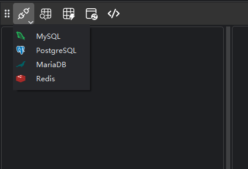
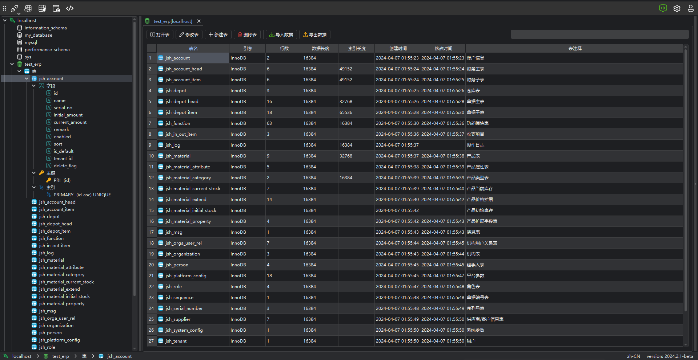
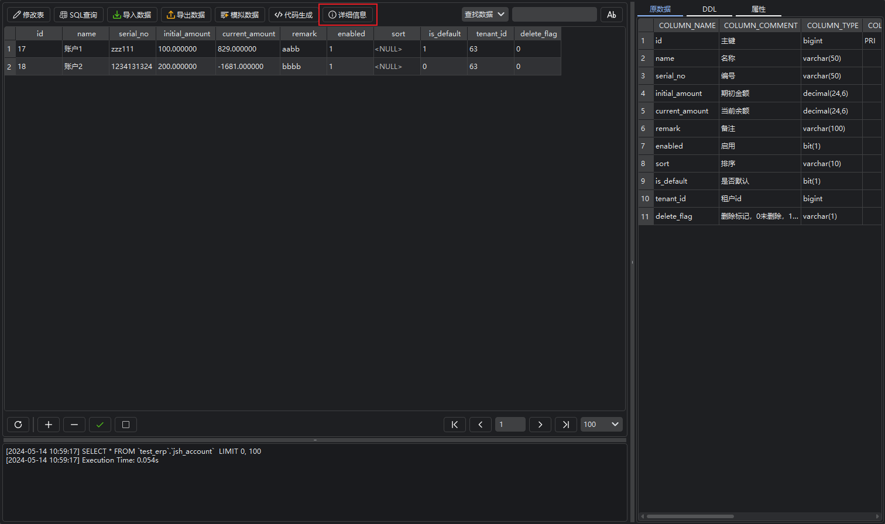
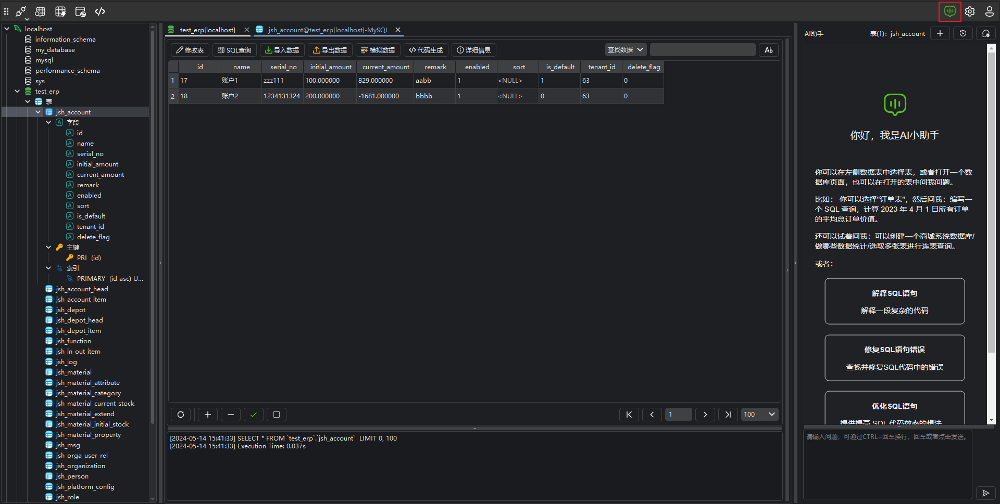
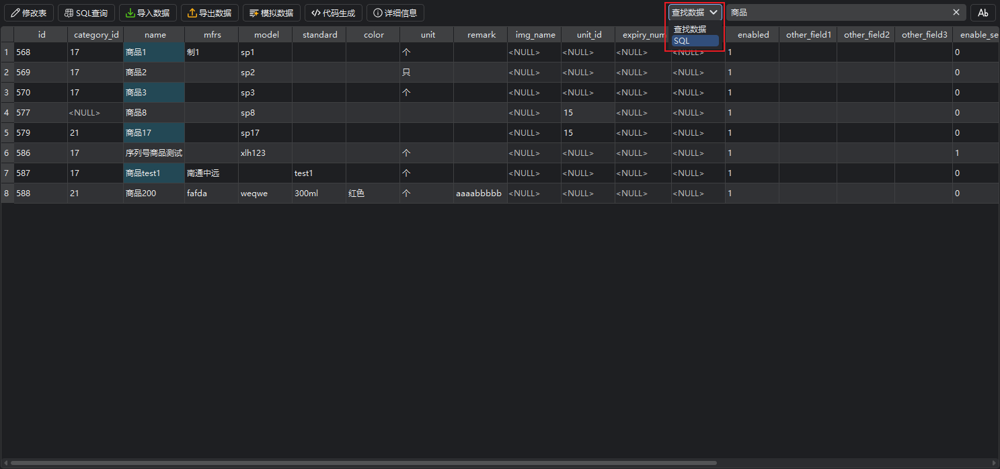
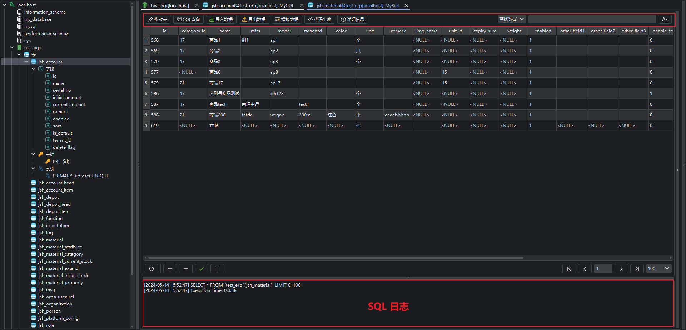
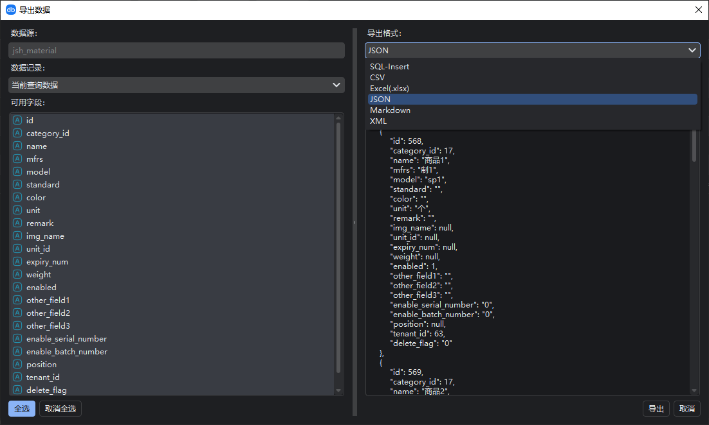
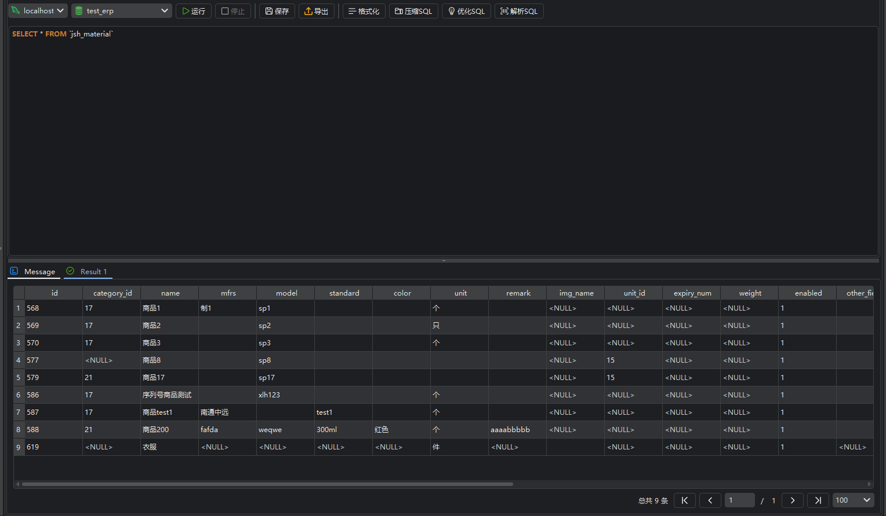

# DBLAB

Free AI Database Management Tool.

  [<a href="README-ZH.md">中文</a>]

Welcome to DBLAB, a versatile, AI-cooperative database management tool, offering a revolutionary database management experience.

DBLab is a robust database management tool designed to provide users with an intuitive and efficient database management experience. Through the integration of AI and a user-friendly interface, DBLab simplifies database management tasks, enabling database administrators and developers to effortlessly manage and operate various databases.

## Key Features

- **Intelligent AI Assistant**: DBLab integrates an advanced ChatGPT AI assistant, allowing users to execute complex database tasks effortlessly through natural language interaction, boosting work efficiency.
- **Multi-Database Support**: DBLab supports various mainstream databases, including but not limited to MySQL, PostgreSQL, MongoDB, and more, depending on the open version support.
- **Visual Query Interface**: Execute and optimize SQL queries through an intuitive interface, with support for result set export and visual representation.
- **Schema Management**: Create, modify, and delete database tables with support for rich data types and constraints.
- **High-Speed Data Import/Export**: Swiftly import and export data.
- **Code Generation**: Quickly generate code with customizable programming languages.

## Technical Support

For any questions or technical support, please visit the [DBLab official website](https://www.dblab.ai/) for assistance.

DBLab Official Website: [dblab.ai](https://www.dblab.ai/)

App Download: [Download](https://www.dblab.ai/#download)

User Documentation: [Documentation](https://www.dblab.ai/docs/)

Issue Tracker: [Issues](https://github.com/dblabai/dblab/issues)

# Quick Start

## Connect to Database Server

When using database management software, connecting to a database is a crucial step.

To create a new connection, click the connect button and select your server type. Then, enter the required information in the connection window.

You can edit the connection properties by right-clicking on the connection and selecting "Edit Connection."

## View Databases

After a successful connection, you can browse the structure and content of the database. Using the navigation tree structure, you can view tables, fields, primary keys, and other objects within the database.

## Browse Data

Once connected to the database, double-click on a data table to easily browse and view the data.

### View Table Details

On the table data view page, clicking the **Details** button reveals metadata information, DDL, and table properties.

Clicking the **Details** button again will close the display.

### Manage Data Using AI Assistant

DBLAB incorporates an AI assistant that can intelligently help you manage data quickly.

#### Open AI Assistant

Click the **AI Assistant** button in the menu bar to open the AI assistant page.

You can click the **+** button to create a new dialogue or click the **History** button to view past interactions.

> **Copy Button**: Copy the current content.
>
> **Console Button**: Open the current SQL statement in the console.
>
> **Run Button**: Run the current SQL statement directly in the console.

### Search Data

In the current table, you can perform a fuzzy search and SQL queries. Click the **Query Data** button to switch to query mode.

### Manage Data

Various data management features are provided, including adding, editing, and deleting records. By right-clicking on table objects, you can access these functions.

### Import/Export Data

Support for exporting data in different formats (such as CSV, Excel) and importing data from external files makes data migration and backup extremely convenient.

## Query Data (SQL Console)

Use the built-in query tool to easily execute SQL queries. Select a table, click the "Query" button, then enter your SQL query statement and execute.

This is just a quick start, and we recommend referring to the detailed user manual for more advanced features and operation information. Enjoy your usage!
